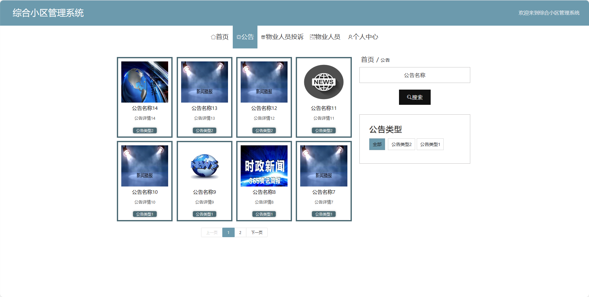

基于Springboot的综合小区管理系统（程序+论文）
=
### 完整代码获取地址：从戎源码网 ([https://armycodes.com/](https://armycodes.com/))
### 作者微信：19941326836  QQ：952045282 
### 承接计算机毕业设计、Java毕业设计、Python毕业设计、深度学习、机器学习
### 选题+开题报告+任务书+程序定制+安装调试+论文+答辩ppt 一条龙服务
### 所有选题地址https://github.com/nature924/allProject

一、项目介绍
---
基于Spring Boot框架实现的综合小区管理系统，系统包含三种角色：管理员、用户，物业人员,系统分为前台和后台两大模块，主要功能如下。
### 【前台功能】

1. 首页：提供用户进入系统的入口，展示小区整体信息和重要通知。
2. 公告：用户可以查看小区发布的通知和公告。
3. 物业人员：用户可以查看小区的物业人员信息。
4. 投诉物业人员：用户可以向物业人员投诉，反映问题和建议。
5. 个人中心：用户可以管理个人信息，包括修改密码、更新个人资料等。

### 【管理员后台功能】

1. 首页：提供管理员进入后台管理的入口。
2. 个人中心：管理员可以管理个人信息。
3. 管理员管理：添加、编辑、删除系统管理员账号。
4. 物业人员管理：添加、编辑、删除物业人员账号。
5. 用户管理：查看、编辑、冻结或删除用户账号。
6. 报修管理：管理用户提交的报修请求。
7. 车位管理：查看和管理小区的车位信息。
8. 出入管理：记录和管理小区的出入情况。
9. 房屋管理：管理小区的房屋信息。
10. 物业费缴纳管理：记录和管理用户的物业费缴纳情况。
11. 公告管理：发布、编辑、删除系统通知和公告。
12. 物业人员投诉管理：处理物业人员被投诉的情况。
13. 我的私信管理：管理员可以查看和管理系统内的私信信息。
14. 基础数据管理：管理系统的基础数据。
15. 轮播图信息：管理员可以设置首页轮播图。

### 【物业人员后台功能】

1. 首页：提供物业人员进入后台管理的入口。
2. 个人中心：物业人员可以管理个人信息。
3. 用户管理：查看、编辑、冻结或删除用户账号。
4. 报修管理：处理用户提交的报修请求。
5. 车位管理：查看和管理小区的车位信息。
6. 出入管理：记录和管理小区的出入情况。
7. 房屋管理：管理小区的房屋信息。
8. 物业费缴纳管理：记录和管理用户的物业费缴纳情况。
9. 公告管理：发布、编辑、删除物业相关通知。
10. 物业人员投诉管理：查看并处理相关投诉。
11. 我的私信管理：物业人员可以查看和管理系统内的私信信息。
12. 轮播图信息：物业人员可以设置首页轮播图。

二、项目技术
---
- 编程语言：Java
- 数据库：MySQL
- 项目管理工具：Maven
- 前端技术：VUE、HTML、Jquery、Bootstrap
- 后端技术：Spring、SpringMVC、MyBatis

三、运行环境
---
- 操作系统：Windows、macOS都可以
- JDK版本：JDK1.8以上都可以
- 开发工具：IDEA、Ecplise、Myecplise都可以
- 数据库: MySQL5.7以上都可以
- Tomcat：任意版本都可以
- Maven：任意版本都可以

四、运行截图
---
### 论文截图：

### 程序截图：

